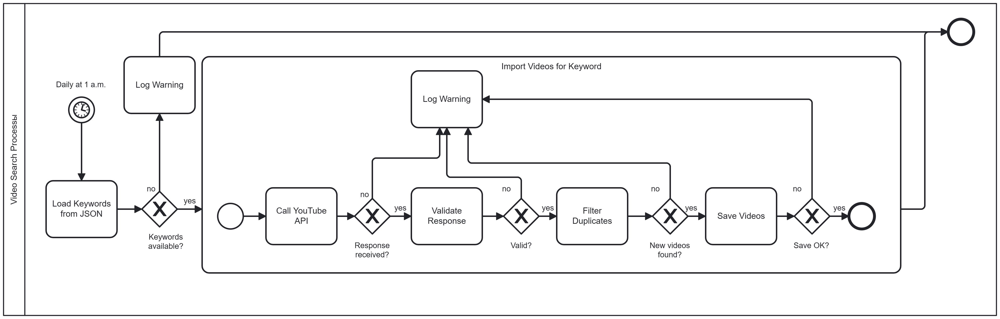
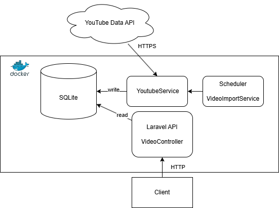

# YouTube Video Loader

A Laravel-based service for collecting, storing, and exposing YouTube videos through a REST API.

The application searches YouTube videos by predefined keywords in multiple languages, stores metadata in a local database, supports historical backfilling, and provides API endpoints for data access and statistics.

---

# Features

- Import newly published YouTube videos
- Historical data backfill
- Multi-language keyword support
- Duplicate protection
- REST API
- OpenAPI documentation
- Automated scheduled imports
- Docker support
- Automated tests

---

# Technology Stack

- PHP 8.3
- Laravel 12
- SQLite
- Docker
- YouTube Data API v3
- OpenAPI (Scramble)
- PHPUnit

---

# Business Process Diagram



---

# API Architecture Diagram



---

# Architecture

## Core Components

### YoutubeService

Responsible for communication with the YouTube Data API.

Responsibilities:

- Execute search requests
- Handle pagination
- Apply publication date filters
- Return normalized API responses

### VideoImportService

Responsible for importing and storing videos.

Responsibilities:

- Daily imports
- Historical imports
- Pagination processing
- Duplicate prevention
- Logging

### KeywordService

Loads keywords grouped by language.

Example:

```json
{
  "en": [
    "climate change",
    "global warming"
  ],
  "de": [
    "Klimawandel",
    "Erderwärmung"
  ]
}
```

### VideoController

Provides REST API endpoints.

### Scheduler

Runs automated imports according to configured schedules.

---

# Import Strategy

## Daily Import

The system imports videos published during the previous day.

Process:

1. Determine the full previous day.
2. Search videos for all configured keywords.
3. Process all available result pages.
4. Store new videos in the database.
5. Skip duplicates automatically.

---

## Historical Import

The system gradually loads older videos.

Process:

1. Determine the earliest stored publication date.
2. Move one day further into the past.
3. Load videos for that period.
4. Repeat according to schedule.

This approach allows incremental historical loading without processing large date ranges at once.

---

# Database Structure

## videos

| Field | Type |
|---------|---------|
| id | bigint |
| youtube_id | string (unique) |
| keyword | string |
| title | string |
| description | text |
| language | string |
| url | string |
| published_at | timestamp |
| created_at | timestamp |
| updated_at | timestamp |

---

# Installation

## Clone Repository

```bash
git clone <repository-url>

cd video-loader
```

## Install Dependencies

```bash
composer install
```

## Create Environment File

```bash
cp .env.example .env
```

Generate application key:

```bash
php artisan key:generate
```

---

# YouTube API Configuration

Add your API key to `.env`:

```env
YOUTUBE_API_KEY=YOUR_API_KEY
```

---

# Database Configuration

Create SQLite database file:

```bash
touch database/database.sqlite
```

Configure environment:

```env
DB_CONNECTION=sqlite
DB_DATABASE=database/database.sqlite
```

Run migrations:

```bash
php artisan migrate
```

---

# Running the Application

```bash
php artisan serve
```

Application URL:

```text
http://localhost:8000
```

---

# Docker

## Build

```bash
docker compose build
```

## Start

```bash
docker compose up -d
```

## Run Migrations

```bash
docker compose exec app php artisan migrate
```

---

# Import Commands

## Daily Import

```bash
php artisan youtube:import
```

## Historical Import

```bash
php artisan youtube:history
```

---

# Scheduler

Run scheduler locally:

```bash
php artisan schedule:work
```

Configured jobs:

- Daily video import
- Historical backfill import

---

# REST API

## Get Videos

```http
GET /api/videos
```

### Filters

By language:

```http
GET /api/videos?language=en
```

By keyword:

```http
GET /api/videos?keyword=climate
```

### Sorting

```http
GET /api/videos?sort=published_at&direction=desc
```

### Pagination

```http
GET /api/videos?per_page=20
```

---

## Get Video By ID

```http
GET /api/videos/{id}
```

---

## Get Statistics

```http
GET /api/stats
```

Example response:

```json
{
  "total_videos": 1250,
  "languages": [
    {
      "language": "en",
      "count": 900
    },
    {
      "language": "de",
      "count": 350
    }
  ]
}
```

---

# OpenAPI Documentation

Generate OpenAPI specification:

```bash
php artisan scramble:export
```

Generated file:

```text
api.json
```

---

# Testing

Run all tests:

```bash
php artisan test
```

Covered functionality:

- API endpoints
- Video persistence
- Duplicate prevention
- Keyword loading

---

# Future Improvements

- Redis caching
- Queue processing
- PostgreSQL support
- OAuth authentication
- Monitoring dashboard
- Import metrics
- Retry mechanism for failed imports

---

### AI-Powered Multilingual Accessibility

The current system already stores video language metadata and can be extended with AI-based processing capabilities.

Possible future enhancements include:

- Automatic translation of video subtitles into multiple languages using AI models.
- AI-generated voice dubbing for translated content.
- Real-time subtitle generation for videos without captions.
- Support for multilingual accessibility, enabling users to consume content regardless of the original language.

### Accessibility for People with Disabilities

The platform can be further extended to improve content accessibility:

#### Hearing Impairments

- Automatic subtitle generation.
- Translation of subtitles into multiple languages.
- Improved subtitle quality using speech recognition and AI correction.

#### Visual Impairments

- AI-generated audio descriptions of visual content.
- Voice narration explaining objects, actions, charts, and scene changes.
- Enhanced audio accessibility for educational and informational videos.

These improvements would help make online video content more accessible and inclusive for a broader audience.

# Author

Nataliia Ivliieva